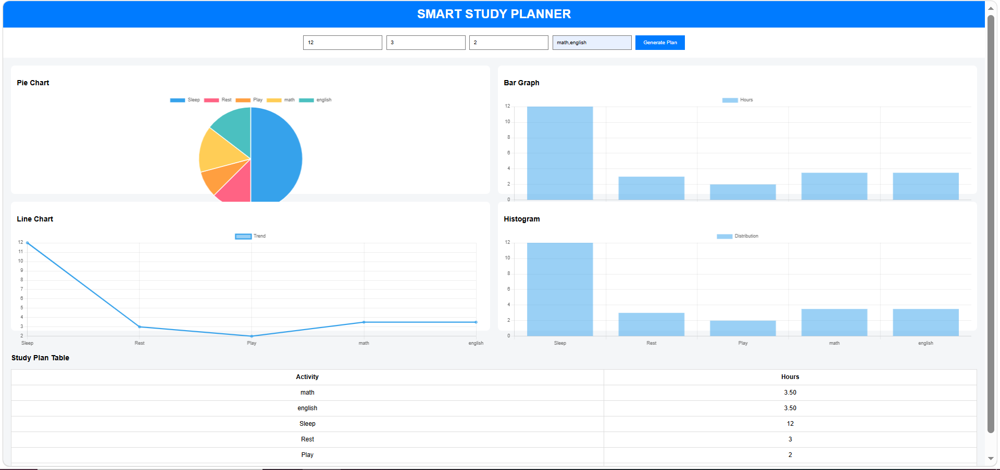

# Smart Study Planner 📊

A simple web app to help plan your daily schedule.

## Features
- Enter sleep, rest, and play hours
- Automatically calculates study time
- Divides study time among subjects
- Displays data in:
  - Table
  - Pie Chart
  - Bar Graph
  - Line Chart
  - Histogram

## Technologies Used
- HTML
- CSS
- JavaScript
- Chart.js

## How to Use
1. Open the website
2. Enter your daily hours
3. Add subjects
4. Click "Generate Plan"
## Preview

## Author
Vinav
